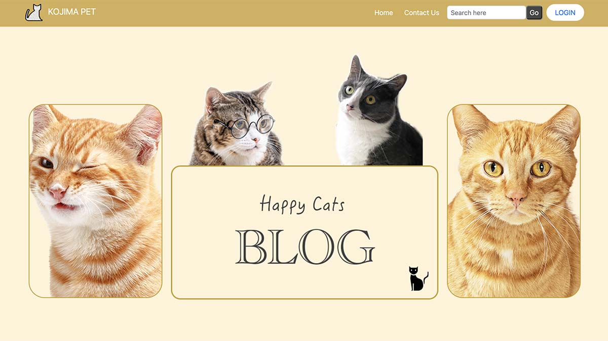

# CAT PHP BLOG

<!-- Image -->

[Website](https://blog-php.kazu-dev.com/)

This project is built using PHP. It is a simple blog website that allows users to login and then create, read, update, and delete posts operations.

## API Reference

## Features
- 

## Prerequisites
Before running this project, make sure you have Node.js installed on your system.

## Installation

To get started with the Anime API & Firebase project, run the following commands:

```bash
npm install
```

## Running the project
```bash
npx mix watch
```

## Languages & tools
- [PHP](https://www.php.net/)
- [Webpack](https://webpack.js.org/)
- [bootstrap](https://getbootstrap.com/)


